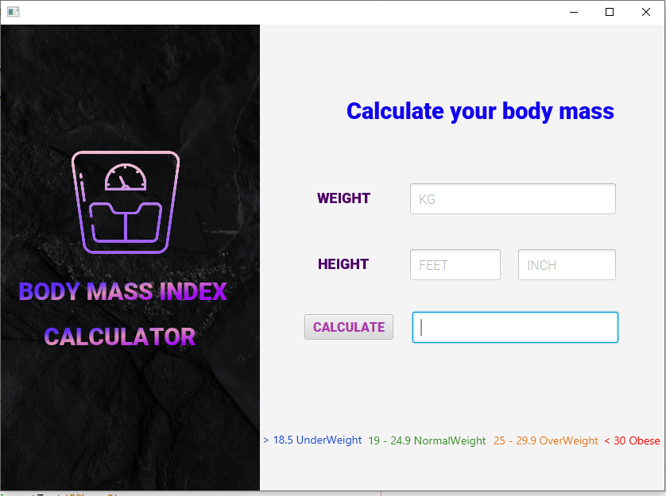
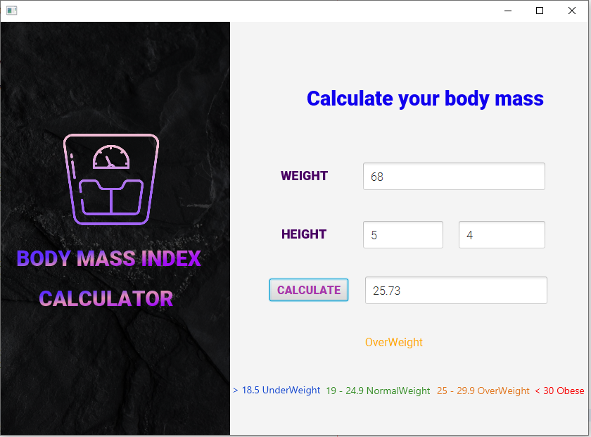
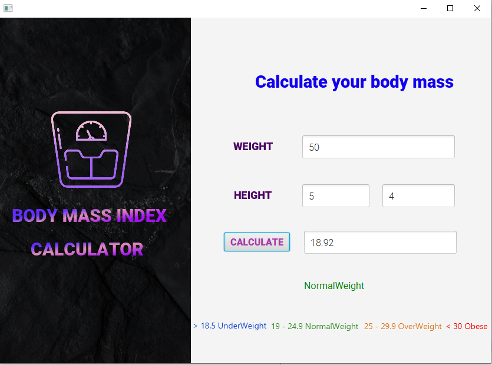
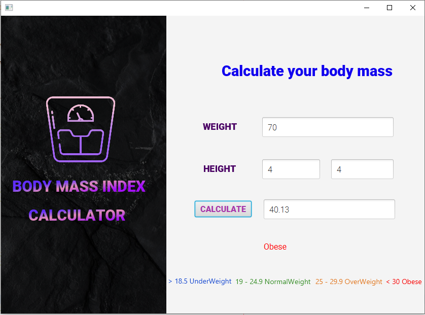
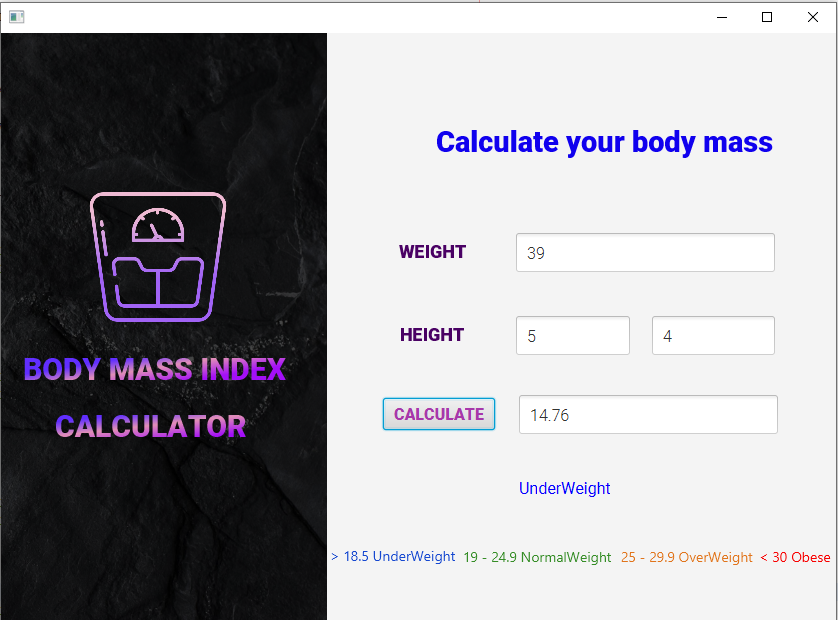

# BMI
Body mass index (BMI) is a measure of body fat based on height and weight that applies to adult men and women.  Enter your weight and height using standard or metric measures. Click "Calculate" and your BMI will appear below. And it will show the different categories of BMI in different colors 

